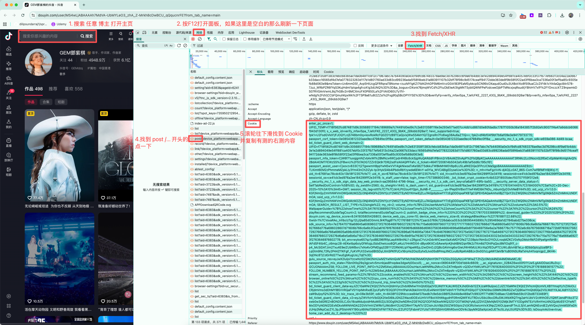

# 达人筛号系统使用教程

欢迎使用达人筛号系统！本教程将指导您完成从数据采集到达人筛选的完整操作流程。

## 🚀 快速开始指南

### 系统概述

达人筛号系统是一个智能化的网红达人筛选和管理平台，主要功能包括：
- **智能爬虫** - 自动采集达人数据
- **智能筛选** - 多维度筛选达人
- **达人对比** - 横向对比分析
- **AI模型** - 智能推荐和分析

---

## 📋 完整操作流程

### 第一步：配置 Cookie（必须）

在开始使用爬虫功能之前，您需要先配置有效的 Cookie 信息。

#### 1.1 获取 Cookie
1. 打开浏览器，访问抖音网页版 (www.douyin.com)
2. 登录您的抖音账号
3. 按 F12 打开开发者工具
4. 切换到 "Network" 网络选项卡
5. 刷新页面，找到任意一个请求
6. 在请求头中找到 "Cookie" 字段，复制完整的 Cookie 值

#### 1.2 填写 Cookie
1. 在系统中找到 Cookie 配置入口
2. 将复制的 Cookie 值粘贴到输入框中
3. 点击"保存"按钮确认配置

> ⚠️ **重要提示**
> - Cookie 是爬虫正常工作的必要条件
> - Cookie 有时效性，如果爬虫失败请及时更新
> - 请使用真实有效的抖音账号 Cookie

---

### 第二步：启动智能爬虫

配置好 Cookie 后，即可开始数据采集。

#### 2.1 进入爬虫模块
1. 点击左侧导航栏的 **"智能爬虫"**
2. 进入爬虫管理页面

#### 2.2 开始爬取数据
1. 在爬虫页面中，找到 **"开始爬虫"** 按钮
2. 点击按钮启动数据采集任务
3. 系统将自动开始爬取抖音达人数据

#### 2.3 监控爬取进度
爬虫启动后，您可以实时监控：
- **爬取状态**：显示当前爬虫运行状态
- **进度信息**：显示已爬取的达人数量
- **日志信息**：显示详细的爬取过程和结果
- **错误提示**：如有异常会显示错误信息

#### 2.4 等待爬取完成
- 爬取过程通常需要几分钟时间
- 请耐心等待，不要关闭页面
- 爬取完成后会显示成功提示
- 系统会显示本次爬取的达人总数

> 📊 **爬取说明**
> - 每次爬取会获取约 20 个达人的详细信息
> - 包含粉丝数、作品数据、互动率等关键指标
> - 数据会自动保存到系统数据库中

---

### 第三步：智能筛选达人

爬取完成后，系统会自动跳转到智能筛选页面，您也可以手动点击导航栏的 **"智能筛选"**。

#### 3.1 查看达人数据
1. 进入智能筛选页面
2. 系统会显示所有已爬取的达人信息
3. 每个达人以卡片形式展示基本信息

#### 3.2 设置筛选条件
在左侧筛选面板中，您可以设置多种筛选条件：

**基础信息筛选**
- **粉丝数量**：设置粉丝数量范围（如：10万-100万）
- **性别**：选择男性、女性或不限
- **地理位置**：按城市或地区筛选
- **年龄段**：18-24岁、25-34岁等

**内容质量筛选**
- **互动率**：设置最低互动率要求
- **发布频率**：30天/90天发布频率
- **爆款内容数**：爆款视频数量要求
- **完播率**：视频完播率筛选

**商业价值筛选**
- **报价范围**：预算范围筛选
- **合作信誉**：历史合作评价
- **MCN机构**：是否签约MCN
- **认证状态**：平台认证情况

#### 3.3 应用筛选条件
1. 在筛选面板中设置所需条件
2. 点击 **"应用筛选"** 按钮
3. 系统会实时更新筛选结果
4. 符合条件的达人会在右侧显示

#### 3.4 查看筛选结果
- **卡片视图**：以卡片形式展示达人信息
- **列表视图**：以表格形式展示详细数据
- **排序功能**：可按粉丝数、互动率等排序
- **详情查看**：点击达人卡片查看详细信息

---

## 🔍 高级功能

### 达人详情查看
1. 在筛选结果中点击任意达人卡片
2. 进入达人详情页面
3. 查看完整的达人档案信息：
   - 基础信息和统计数据
   - 近期作品和表现
   - 粉丝画像分析
   - 商业合作潜力评估

### 达人对比分析
1. 在筛选结果中选择多个达人（2-5个）
2. 点击 **"对比分析"** 按钮
3. 查看横向对比报告：
   - 基础数据对比
   - 内容质量对比
   - 商业价值对比
   - 综合评分排名

### 数据导出
1. 选择需要导出的达人
2. 点击 **"导出数据"** 按钮
3. 选择导出格式（Excel/PDF）
4. 自定义导出字段
5. 下载导出文件

---

## 🤖 AI 智能推荐

### 智能标签
系统会自动为每个达人生成智能标签：
- **内容风格**：搞笑、美妆、科技等
- **受众特征**：年轻女性、科技爱好者等
- **商业价值**：高性价比、品牌匹配度等

### 潜力评估
AI 模型会评估达人的发展潜力：
- **成长趋势**：粉丝增长趋势预测
- **内容创新**：内容创新能力评分
- **商业潜力**：未来商业价值预估

---

## ⚠️ 注意事项

### Cookie 管理
- Cookie 有效期通常为 7-30 天
- 如果爬虫失败，请及时更新 Cookie
- 建议定期检查 Cookie 有效性

### 爬虫使用规范
- 合理控制爬取频率，避免对平台造成压力
- 遵守相关平台的使用条款和法律法规
- 建议在非高峰时段进行大量数据采集

### 数据时效性
- 达人数据具有时效性，建议定期更新
- 重要决策前请验证数据的准确性
- 可以通过重新爬取来获取最新数据

---

## 🔧 常见问题

### Q: Cookie 配置后爬虫仍然失败怎么办？
A: 请检查 Cookie 是否完整复制，确保包含所有必要的认证信息。如果问题持续，请尝试重新获取 Cookie。

### Q: 爬取的达人数量较少怎么办？
A: 这可能是由于平台限制或网络问题导致。可以稍后重试，或者检查网络连接状态。

### Q: 筛选结果为空怎么办？
A: 请检查筛选条件是否过于严格，可以适当放宽条件范围，或者先爬取更多数据。

### Q: 如何获取更多达人数据？
A: 可以多次运行爬虫任务，系统会累积保存所有爬取的达人数据。

---

## 📞 技术支持

如果您在使用过程中遇到任何问题，请通过以下方式联系我们：

- **在线客服**：工作日 9:00-18:00
- **技术支持**：遇到技术问题可随时咨询
- **使用建议**：欢迎提供产品改进建议

---

*感谢您使用达人筛号系统！按照以上步骤操作，您就能快速上手并高效地筛选到合适的达人。*