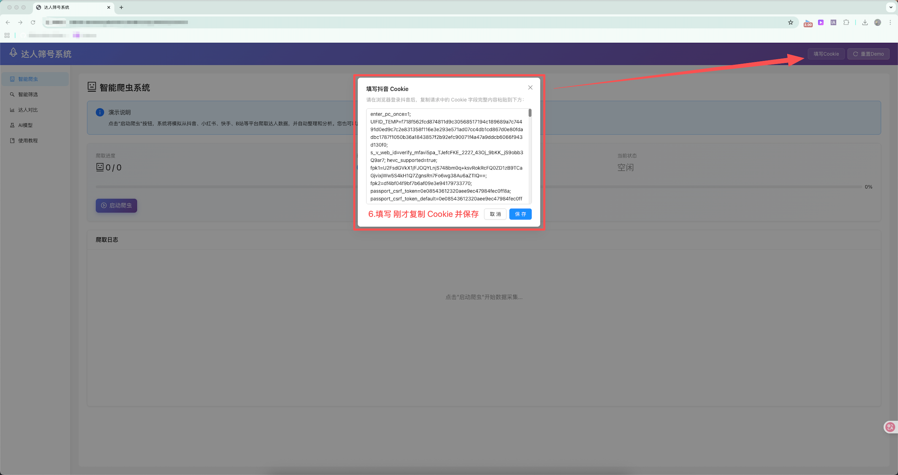
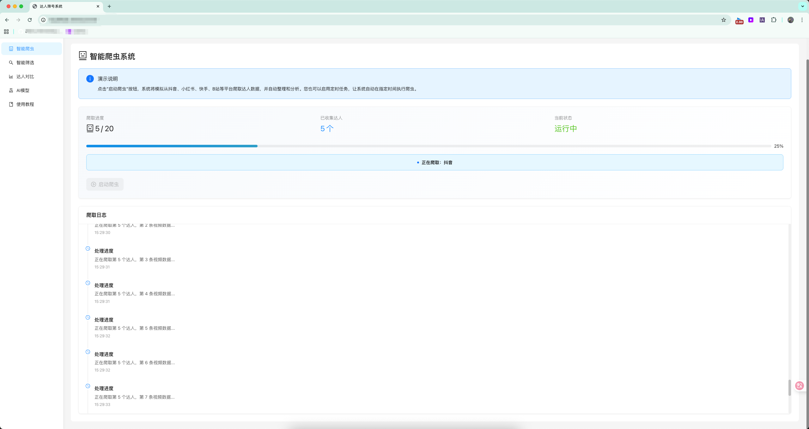
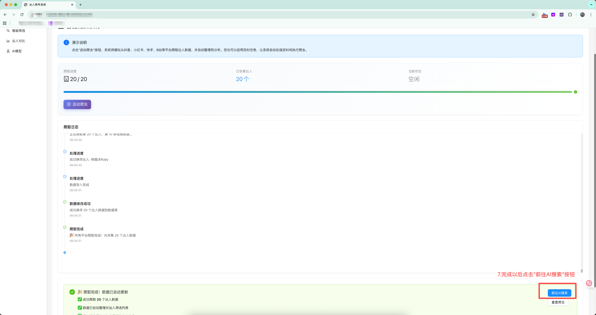
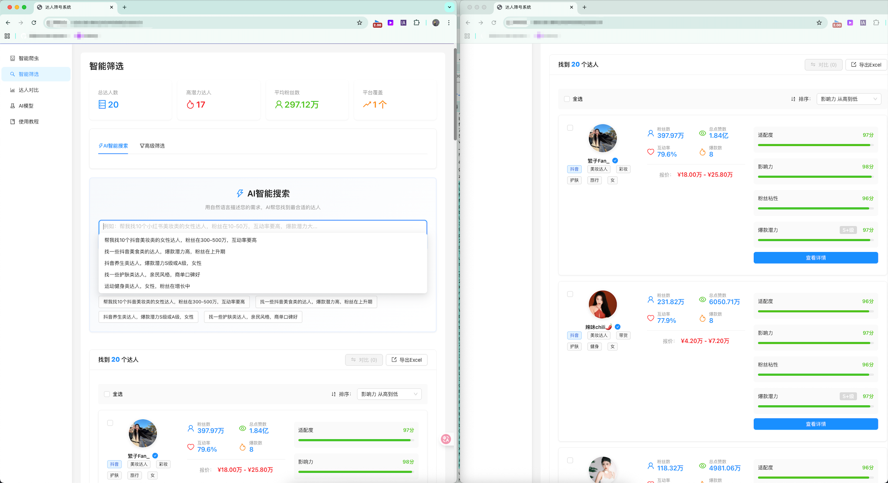
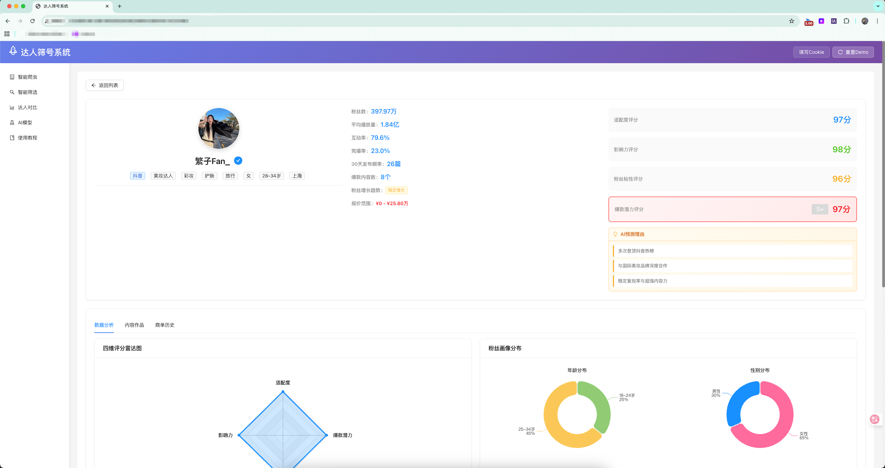
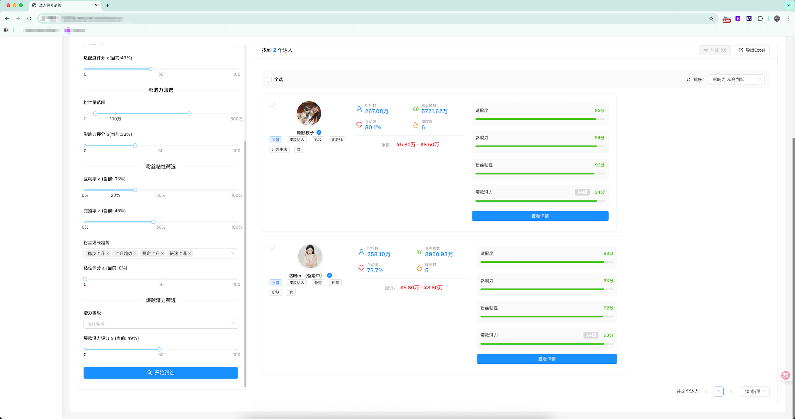
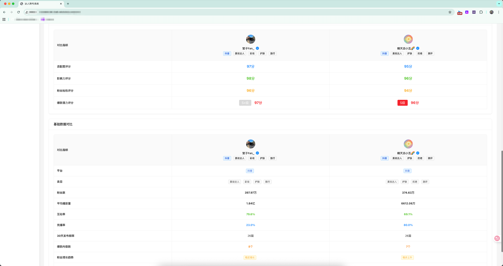

# 达人筛号系统使用教程

欢迎使用达人筛号系统(Demo)！本教程将指导您完成从数据采集到达人筛选的完整操作流程。

## 🚀 快速开始指南

### 系统概述

达人筛号系统是一个智能化的网红达人筛选和管理平台，主要功能包括：
- **智能爬虫** - 自动采集达人数据
- **智能筛选** - 多维度筛选达人
- **达人对比** - 横向对比分析

---

## 📋 完整操作流程

### 第一步：配置 Cookie（必须）

在开始使用爬虫功能之前，您需要先配置有效的 Cookie 信息。

#### 1.1 获取 Cookie
1. 打开浏览器，访问抖音网页版 (www.douyin.com)
2. 登录您的抖音账号
3. 打开任意博主主页 (https://www.douyin.com/user/MS4wLjABAAAAh7MdVA-UbMYLeO3_zhA_Z-Mrkh8cDwBCU_qQqucnrFE)
4. 按 F12 打开开发者工具
5. 切换到 "Network" 网络选项卡
6. 刷新页面，找到"post/xxx"请求
7. 在请求头中找到 "Cookie" 字段，复制完整的 Cookie 值

#### 1.2 填写 Cookie
1. 在系统中找到 Cookie 配置入口
2. 将复制的 Cookie 值粘贴到输入框中
3. 点击"保存"按钮确认配置

> ⚠️ **重要提示**
> - Cookie 是爬虫正常工作的必要条件
> - Cookie 有时效性，如果爬虫失败请及时更新
> - 请使用真实有效的抖音账号 Cookie

---

### 第二步：启动智能爬虫

配置好 Cookie 后，即可开始数据采集。

#### 2.1 进入爬虫模块
1. 点击左侧导航栏的 **"智能爬虫"**
2. 进入爬虫管理页面

#### 2.2 开始爬取数据
1. 在爬虫页面中，找到 **"开始爬虫"** 按钮
2. 点击按钮启动数据采集任务
3. 系统将自动开始爬取抖音达人数据
4. 爬取数据过程中请不要刷新页面或关闭浏览器

#### 2.3 监控爬取进度
爬虫启动后，您可以实时监控：
- **爬取状态**：显示当前爬虫运行状态
- **进度信息**：显示已爬取的达人数量
- **日志信息**：显示详细的爬取过程和结果

#### 2.4 等待爬取完成
- 爬取过程通常需要几分钟时间
- 请耐心等待，不要关闭页面
- 爬取完成后会显示成功提示
- 系统会显示本次爬取的达人总数

> 📊 **爬取说明**
> - 每次爬取会获取约 20 个达人的详细信息
> - 包含粉丝数、作品数据、互动率等关键指标
> - 数据会自动保存到系统数据库中

---

### 第三步：智能筛选达人

爬取完成后，可以手动点击导航栏的 **"智能筛选"**。

#### 3.1 查看达人数据
1. 进入智能筛选页面
2. 系统会显示所有已爬取的达人信息
3. 每个达人以卡片形式展示基本信息

#### 3.2 设置筛选条件
在高级筛选面板中，您可以设置多种筛选条件：

**基础信息筛选**
- **粉丝数量**：设置粉丝数量范围（如：10万-100万）
- **性别**：选择男性、女性或不限等

**内容质量筛选**
- **互动率**：设置最低互动率要求
- **发布频率**：30天/90天发布频率等

**商业价值筛选**
- **报价范围**：预算范围筛选等

#### 3.3 应用筛选条件
1. 在筛选面板中设置所需条件
2. 点击 **"应用筛选"** 按钮
3. 系统会实时更新筛选结果
4. 符合条件的达人会在右侧显示

---

## 🔍 高级功能

### 达人对比分析
1. 在筛选结果中选择多个达人（2-5个）
2. 点击 **"对比分析"** 按钮
3. 查看横向对比报告：
   - 基础数据对比
   - 内容质量对比
   - 商业价值对比
   - 综合评分排名

## ⚠️ 注意事项

### Cookie 管理
- 浏览器登录
- 如果爬虫失败，请及时更新 Cookie
- 建议定期检查 Cookie 有效性

*感谢您使用达人筛号系统！按照以上步骤操作，您就能快速上手并高效地筛选到合适的达人。*